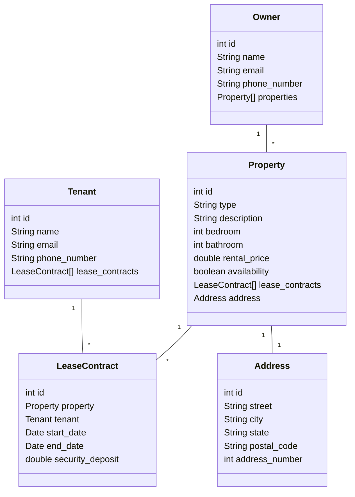

#  GFT Desenvolvimento Java com IA Bootcamp

## Descrição
Java RESTful API criada para o bootcamp GFT-Java-IA. 
- Spring Boot 3
- Java 21
- Railway 

## Diagrama de Classes

```mermaid
classDiagram
    class Owner {
        int id
        String name
        String email
        String phone_number
        Property[] properties
    }
    
    class Property {
        int id
        String type
        String description
        int bedroom
        int bathroom
        double rental_price
        boolean availability
        LeaseContract[] lease_contracts
        Address address
    }
    
    class LeaseContract {
        int id
        Property property
        Tenant tenant
        Date start_date
        Date end_date
        double security_deposit
    }
    
    class Tenant {
        int id
        String name
        String email
        String phone_number
        LeaseContract[] lease_contracts
    }
    
    class Address {
        int id
        String street
        String city
        String state
        String postal_code
        int address_number
    }

    Owner "1" -- "*" Property 
    Property "1" -- "*" LeaseContract 
    Property "1" -- "1" Address 
    Tenant "1" -- "*" LeaseContract 
```
